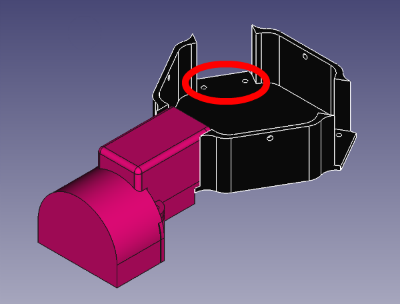

#loki

A omnidirectional tiny platform to create awesome project.

It uses three modules composed by a wheel and a engine. This module can be used in any configuration and in any number because it is designed to be an independant module.

Just need to use create a base with two holes per module and use two M3 screw to join the module to the base.

